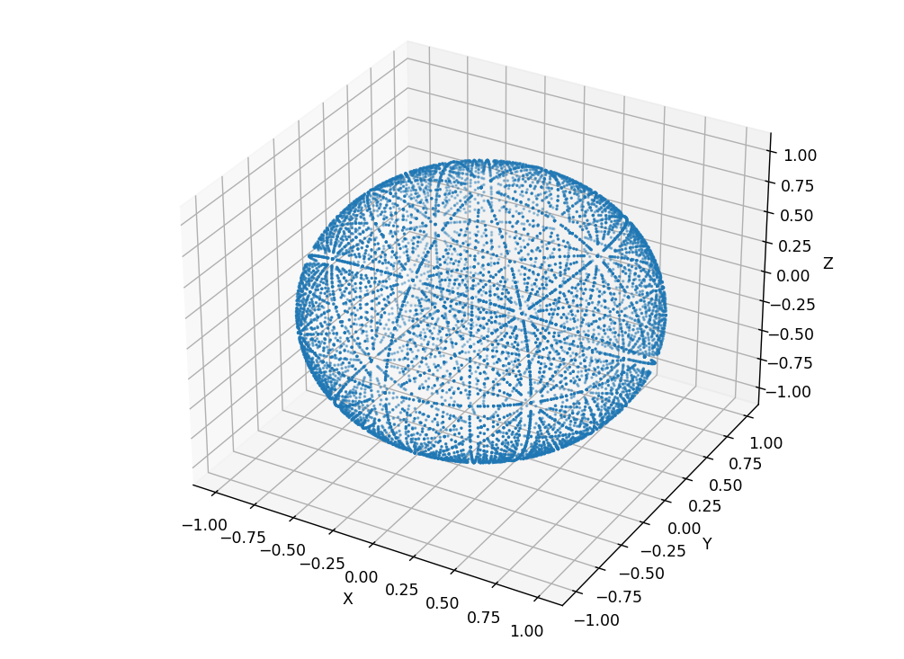

## [Cubed Sphere Mesh](CubedSphere.py)
Given a point (x, y, z) on the unit cube where -1 ≤ x, y, z ≤ 1:

Determine the face of the cube the point lies on based on its maximum absolute coordinate value. The six faces of the cube are: +X, -X, +Y, -Y, +Z, -Z.

Map the coordinates onto the unit sphere using the following formulas for each face:

    +X face: (1, -y, -z)
    -X face: (-1, y, z)
    +Y face: (x, 1, -z)
    -Y face: (x, -1, z)
    +Z face: (x, -y, 1)
    -Z face: (-x, -y, -1)
Normalize the resulting coordinates (x', y', z') by dividing each component by the Euclidean length of the vector (x', y', z').

The resulting (x', y', z') coordinates will lie on the unit sphere and form a cubed sphere mesh.

Note: The above representation assumes a unit cube, but the scaling and positioning of the cube can be adjusted as needed.

# Not Finished