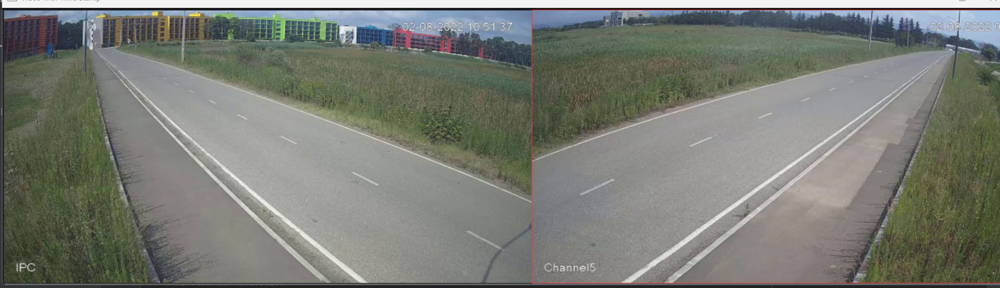
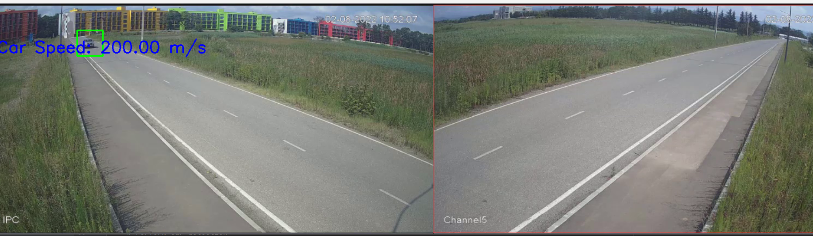
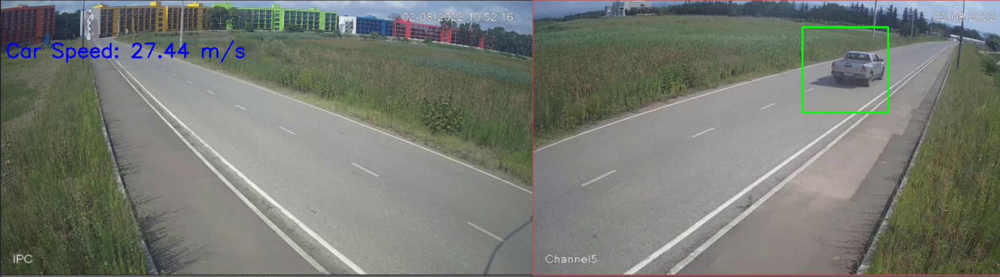
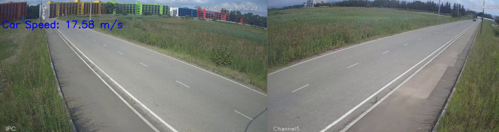
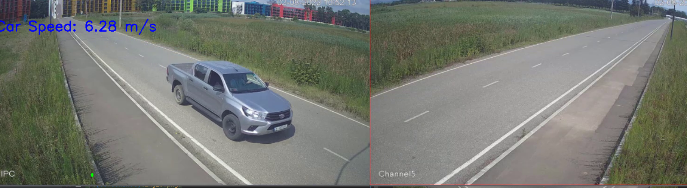

### [**SpeedDetection.py**](SpeedDetection.py)
    This code detects a car in a video frame using pre-trained car detection model (Haar cascade).
    Does not use edge detection and FD derivative filters. 
    

### *How it works*

    Initialize variables: 

    previous_frame_time = 0
    first_detection_time = None
    last_detection_time = None
    car_speed = None
    car_distance = 300  # Distance in meters
    car_last_detection_time = None

   * Loads the file Car.xml 
   * Open video file
   * Get frames per second (fps) value from the video
   * Get total number of frames in the video
   * Calculate time interval between frames
   * Convert frame to grayscale and perform car detection
   * Process each detected car
   * Gets timeframe between first detection and the last
   * Calculate car speed (Speed is shown on the video as a stamp)
> * for exit press: q
> * Value for distance covered by the car is given: 300 m 

  ### [**SpeedDetection2**](Speed_Det_FD_Edge_det.py)
    This code detects a car in a video frame using edge detection and FD derivative filters. 
    Does not work as effectively as the previous code. 

### *How it works*

    Initialize variables: 

    previous_frame_time = 0
    first_detection_time = None
    last_detection_time = None
    car_speed = None
    car_distance = 300  # Distance in meters
    car_last_detection_time = None

   * Loads the file Car.xml 
   * Open video file
   * Get frames per second (fps) value from the video
   * Get total number of frames in the video
   * Read frame from the video and convert to grayscale
   * Apply Canny edge detection and Sobel derivative filters to compute gradients
   * Calculate magnitude and direction of gradients
   * Define thresholds for car detection
   * Perform Car Detection and process each detected car
   * After: works exactly as the previous code to calculate speed

> * for exit press: q
> * Value for distance covered by the car is given: 300 m 
> * Works slower than the previous code

